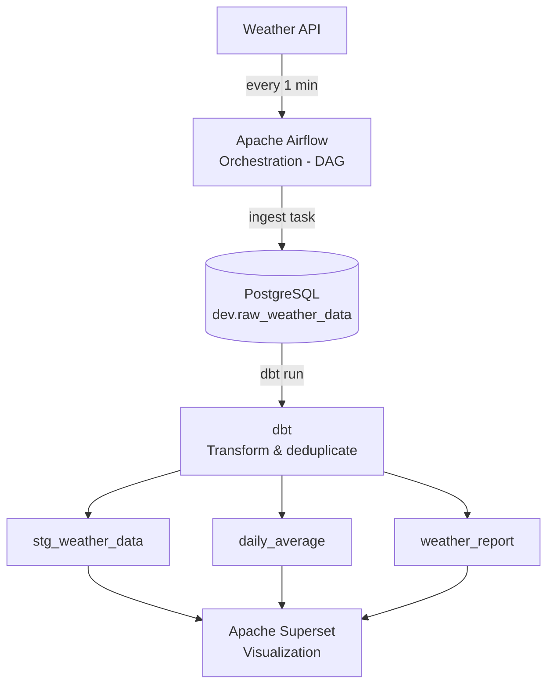

# 🌤️ Weather Data Pipeline Project

An end-to-end data engineering project that collects, transforms, and visualizes real-time weather data using a modern data stack.

## 📐 Architecture



## 🛠️ Tech Stack

| Tool | Version | Role |
|------|---------|------|
| Apache Airflow | 3.0.0 | Pipeline orchestration |
| PostgreSQL | 14 | Data storage |
| dbt | 1.9.0 | Data transformation |
| Apache Superset | 3.0.0 | Data visualization |
| Redis | 7 | Superset caching |
| Docker | - | Containerization |

## 📁 Project Structure

```
project-weather/
├── airflow/
│   └── dags/
│       └── orchestrator.py            # DAG: ingest → transform
├── api-request/
│   ├── api_request.py                 # Fetch weather data from API
│   └── insert_records.py             # Insert raw data into PostgreSQL
├── dbt/
│   ├── profiles.yml                   # dbt connection config
│   └── my_project/
│       └── models/
│           ├── staging/
│           │   ├── sources.yml
│           │   └── stg_weather_data.sql   # Clean & deduplicate raw data
│           └── mart/
│               ├── daily_average.sql      # Avg temperature & wind by city/date
│               └── weather_report.sql     # Final report for visualization
├── postgres/
│   ├── airflow_init.sql               # Initialize Airflow database
│   └── superset_init.sql             # Initialize Superset database
├── docker/
│   ├── .env                           # Superset environment variables
│   ├── superset_config.py
│   ├── docker-bootstrap.sh
│   └── docker-init.sh
└── docker-compose.yaml
```

## 🚀 Getting Started

### Prerequisites

- Docker & Docker Compose
- Git

### 1. Clone the repository

```bash
git clone https://github.com/Ndhai0301/Weather-data-project.git
cd Weather-data-project
```

### 2. Start all services

```bash
docker compose up -d
```

### 3. Get the Airflow admin password

```bash
docker compose exec af cat /opt/airflow/simple_auth_manager_passwords.json.generated
```

### 4. Access the services

| Service | URL | Credentials |
|---------|-----|-------------|
| Airflow | http://localhost:8000 | admin / (see step 3) |
| Superset | http://localhost:8088 | admin / admin |
| PostgreSQL | localhost:5000 | db_user / db_password |

### 5. Trigger the pipeline

- Go to Airflow UI → Enable DAG `weather-api-dbt-orchestrator`
- The DAG runs automatically every 1 minute:
  1. **Task 1** `ingest_data_task` — Fetches weather data from the API and inserts it into `dev.raw_weather_data`
  2. **Task 2** `transform_data_task` — Runs `dbt run` to transform and load the data into mart tables

### 6. Connect Superset to PostgreSQL

- Go to Superset → Settings → Database Connections
- Add a new connection with the following URI:
```
postgresql://db_user:db_password@db:5432/db
```
- Select the `dev` schema to create datasets and build dashboards

## 📊 Data Models

### Staging: `dev.stg_weather_data`
Cleans and deduplicates raw data from the source table.

| Column | Description |
|--------|-------------|
| id | Primary key |
| city | City name |
| temperature | Temperature (°C) |
| weather_descriptions | Weather condition description |
| wind_speed | Wind speed |
| weather_time_local | Local weather observation time |
| inserted_at_local | Record insertion time (local timezone) |

### Mart: `dev.daily_average`
Aggregated daily statistics per city.

| Column | Description |
|--------|-------------|
| city | City name |
| date | Date |
| avg_temperature | Average temperature |
| avg_wind_speed | Average wind speed |

### Mart: `dev.weather_report`
Final reporting table used for Superset visualization.

| Column | Description |
|--------|-------------|
| city | City name |
| temperature | Temperature (°C) |
| weather_descriptions | Weather condition description |
| wind_speed | Wind speed |
| weather_time_local | Local weather observation time |

## 📝 Notes

- Weather data is collected every **1 minute** automatically via Airflow
- dbt handles **deduplication** based on the `time` field using `ROW_NUMBER()`
- Timestamps are converted to **local timezone** using the `utc_offset` field
